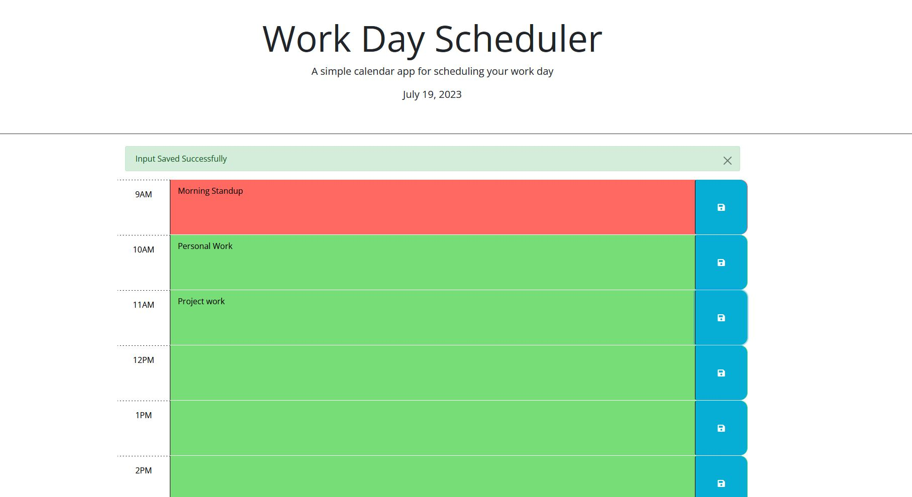

# SchedulingCalendar

## Description
    - The goal of this project was to create a simple day planner that could save items and 
    reflect the time of day by changing the colors of the time slots as the day progresses. 
    - This project was built to have a simple day planner that could save information to the browser and be updated dynamically using dayjs. 
    -it solves the problem of having a disorganized calendar 
    - I learned a lot more JavaScript and how to integrated Bootstrap Elements within HTML and JS. It took some troubleshooting and digging through documentation to fully understand the concepts of if, else if, and else statements to get this fully operational. 

 ## Installation 

    - There should be no need for any type of installation. Just open click the link in the repo. 

## Usage 

    - The site should look something like the image below: 
    

## Credits

    - I used MDN docs, and the Bootstrap documentation heavily for this project. 
    [Bootstrap Alerts](https://getbootstrap.com/docs/4.0/components/alerts/)

    
